# 动态路由系统设计文档

## 一、架构概览

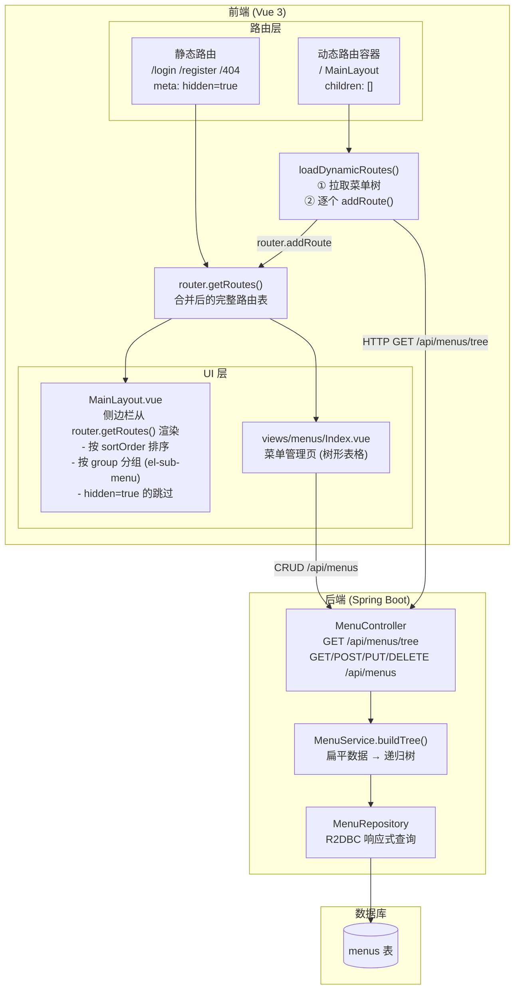

---

## 二、数据库设计

### menus 表结构

```sql
CREATE TABLE `menus` (
    `id`            BIGINT       AUTO_INCREMENT PRIMARY KEY,
    `parent_id`     BIGINT       DEFAULT NULL,
    `path`          VARCHAR(255) NOT NULL,
    `name`          VARCHAR(100) NOT NULL,
    `component`     VARCHAR(255) DEFAULT NULL,
    `title`         VARCHAR(100) NOT NULL,
    `icon`          VARCHAR(100) DEFAULT NULL,
    `type`          VARCHAR(20)  DEFAULT 'MENU',
    `requires_auth` TINYINT(1)   DEFAULT 1,
    `sort_order`    INT          DEFAULT 0,
    `status`        TINYINT(1)   DEFAULT 1,
    `created_at`    DATETIME     DEFAULT CURRENT_TIMESTAMP,
    `updated_at`    DATETIME     DEFAULT CURRENT_TIMESTAMP ON UPDATE CURRENT_TIMESTAMP,
    FOREIGN KEY (`parent_id`) REFERENCES `menus`(`id`) ON DELETE CASCADE
);
```

### 种子数据 -> 树形结构

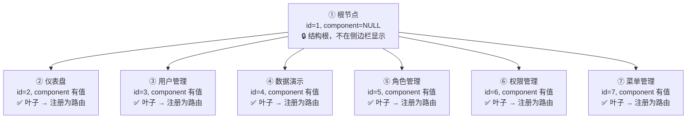

### 扩展：添加分组后的结构

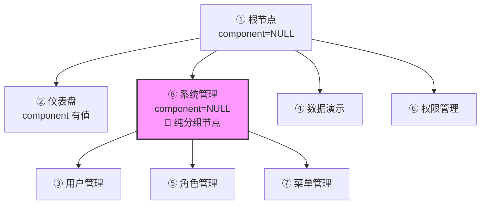

> 分组节点的 `sortOrder` 控制分组在侧边栏的位置；组内子节点的 `sortOrder` 控制组内顺序。最终排序号 = 父 sortOrder × 1000 + 子 sortOrder。

---

## 三、后端实现

### 3.1 核心文件

| 文件 | 职责 |
|---|---|
| `entity/Menu.java` | 实体类，映射 `menus` 表 |
| `dto/MenuTreeNode.java` | 树节点 DTO，含 `List<MenuTreeNode> children` |
| `repository/MenuRepository.java` | 数据访问，继承 `R2dbcRepository` + `PageableRepository` |
| `service/MenuService.java` | **核心：`buildTree()` 将扁平数据构建为递归树** |
| `controller/MenuController.java` | REST 控制器，继承 `BaseController` 获得 CRUD，新增 `/tree` |

### 3.2 树构建算法 `buildTree()`

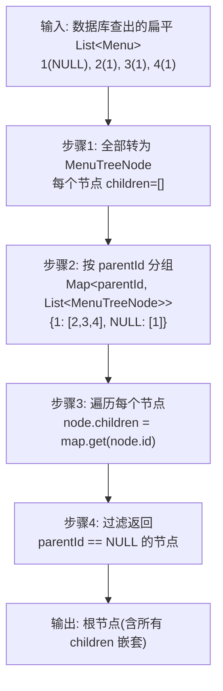

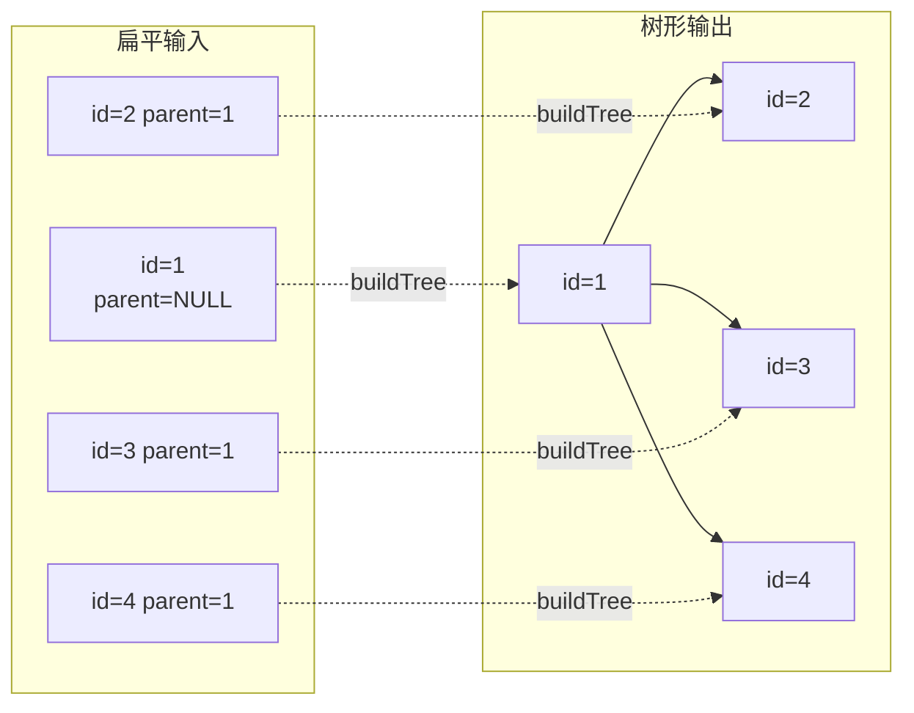

### 3.3 API 端点

| 方法 | 路径 | 说明 |
|---|---|---|
| `GET` | `/api/menus/tree` | **返回完整菜单树**（前端路由注册 + 侧边栏渲染） |
| `GET` | `/api/menus?page=1&size=10` | 分页查询（菜单管理页） |
| `GET` | `/api/menus/{id}` | 查询单个菜单 |
| `POST` | `/api/menus` | 新增菜单 |
| `PUT` | `/api/menus/{id}` | 更新菜单 |
| `DELETE` | `/api/menus/{id}` | 删除菜单（级联删除子菜单） |

---

## 四、前端实现

### 4.1 路由拆分

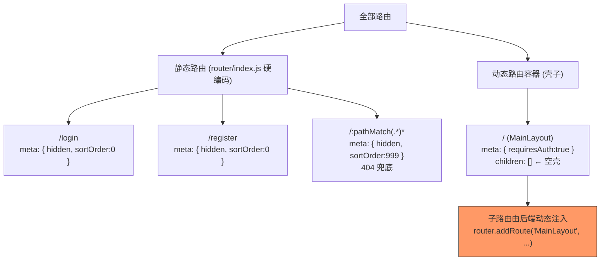

### 4.2 动态路由加载流程

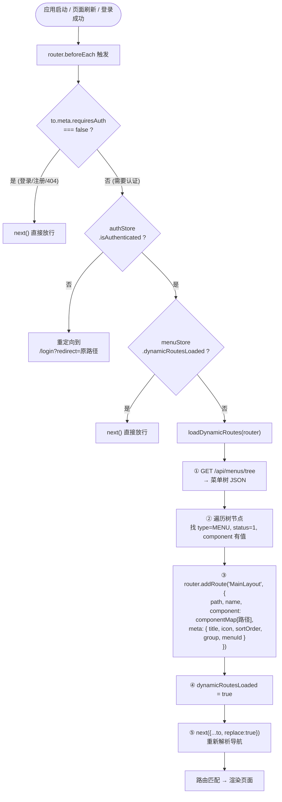

### 4.3 componentMap 原理

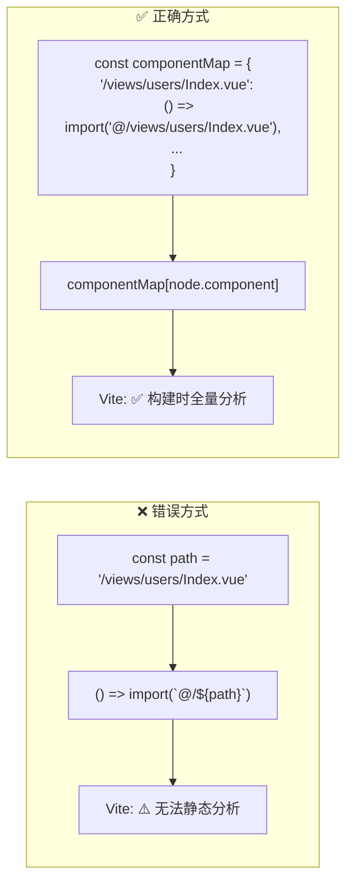

### 4.4 侧边栏生成

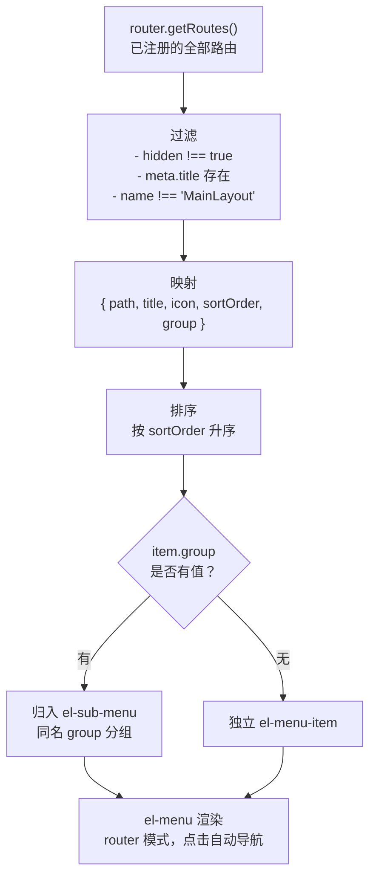

### 4.5 核心文件总览

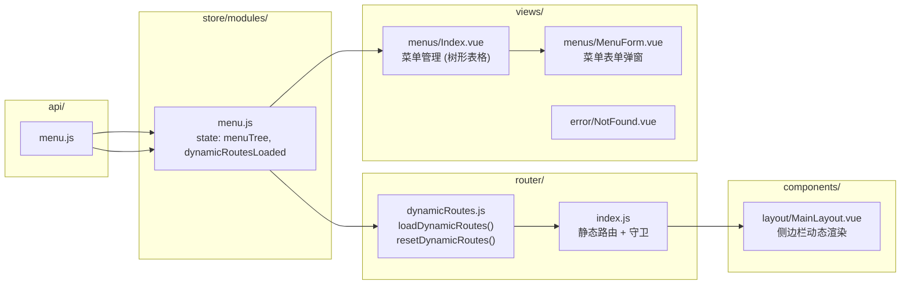

---

## 五、时序图

### 5.1 登录流程

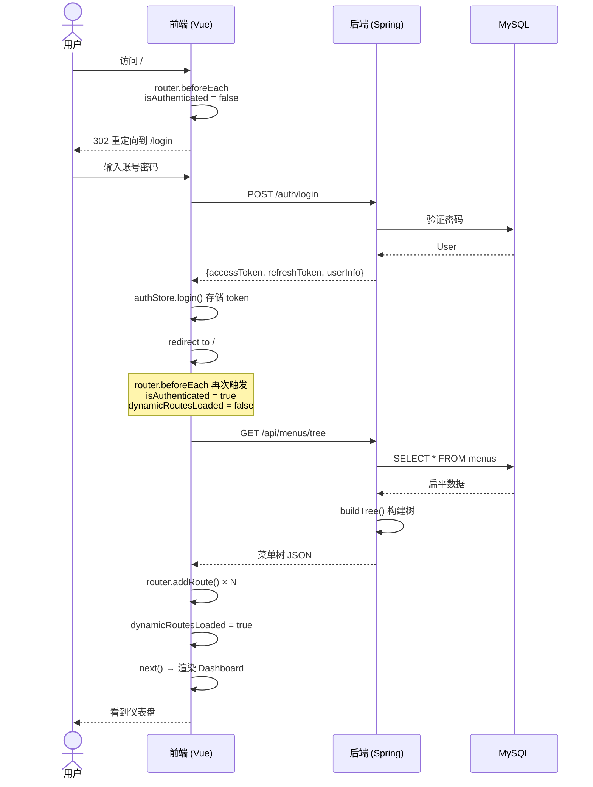

### 5.2 页面刷新恢复

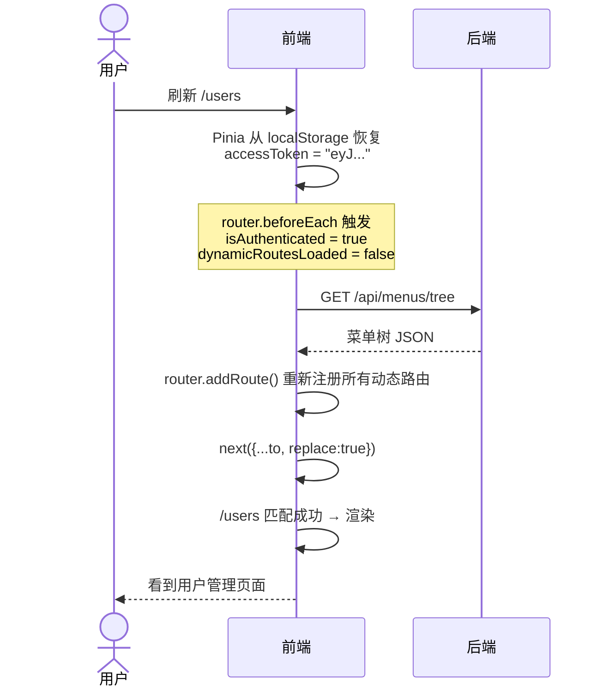

### 5.3 新增菜单后路由同步

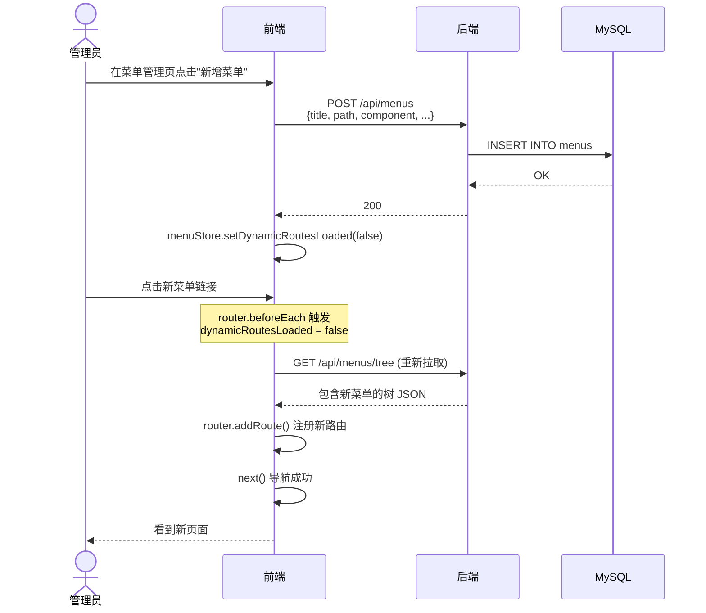

### 5.4 登出清理

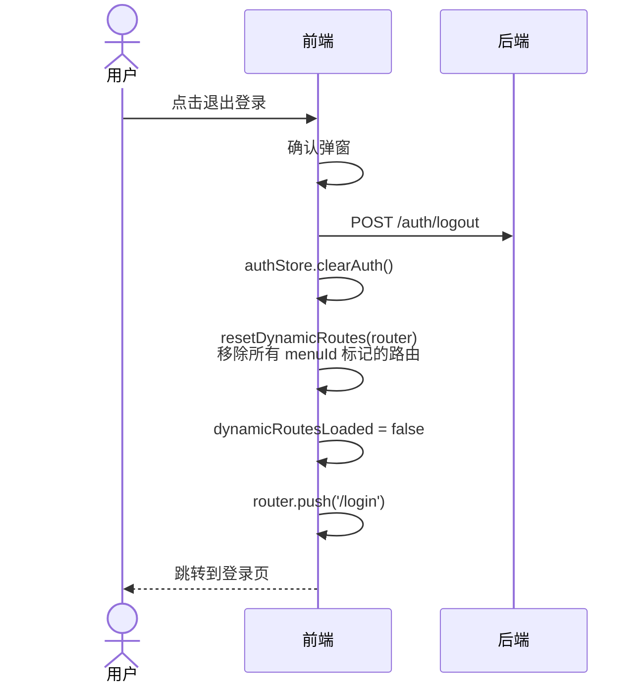

---

## 六、关键设计决策

| 决策 | 原因 |
|---|---|
| **componentMap 静态映射** | Vite 构建时分析 `import()` 必须静态，不能用运行时字符串拼接 |
| **路由守卫中加载动态路由** | 保证刷新页面后路由能恢复；避免 main.js 初始化时依赖异步 |
| **`dynamicRoutesLoaded` 标记** | 防止每次导航都重复请求菜单树 |
| **侧边栏从 `router.getRoutes()` 读取** | 单一数据源，已注册的路由才是可访问的；与 menuStore 解耦 |
| **排序号 `父*1000 + 子`** | 保证分组间有序，分组内也有序，支持最多 999 个子菜单数量 |
| **菜单 CRUD 后重置 `dynamicRoutesLoaded`** | 下次导航自动重新加载路由，无需手动操作 |
| **根层级不传 group** | 根节点只是结构容器，不应成为侧边栏分组名 |
| **`hidden: true` 标记** | 登录/注册/404 等路由注册但不显示在侧边栏 |
